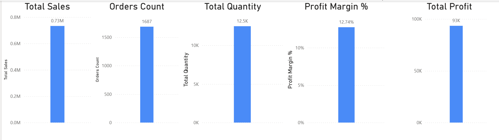
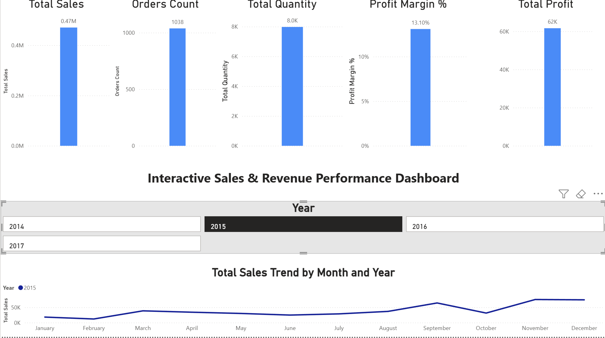

# Interactive Sales & Revenue Performance Dashboard (Power BI)

## 📌 Project Overview
This project showcases an interactive Power BI dashboard developed to analyze sales and revenue performance using a retail Superstore dataset. The dashboard enables business stakeholders to monitor key performance indicators (KPIs) and analyze monthly sales trends with dynamic filtering.

## 🎯 Business Objectives
- Monitor overall sales, profit, and order performance
- Analyze monthly sales trends across years
- Enable year-wise performance comparison using slicers
- Provide executive-level KPI visibility

## 📊 Key Features
- KPI Cards: Total Sales, Total Profit, Orders Count, Quantity Sold, Profit Margin %
- Interactive Year Slicer (2014–2017)
- Monthly Sales Trend Analysis
- Clean and professional dashboard layout

## 🛠 Tools & Technologies
- Power BI Desktop
- Power Query (Data Cleaning & Transformation)
- DAX Measures
- CSV Dataset

## 📂 Dataset
- Superstore Sales Dataset
- Includes order dates, sales, profit, quantity, region, and product details

## 📊 Dashboard Preview

## 🔍 Key Insights
- Identified peak sales periods across different years
- Observed consistent sales growth toward year-end months
- Enabled quick performance comparison using interactive slicers

## 🧠 Skills Demonstrated
- Business Intelligence Reporting
- KPI Design & Analysis
- Time-Series Trend Analysis
- Data Modeling
- Data Visualization

---

👤 **Author**: Rajesh Babu Santigari  
🎓 Master of IT in Business (FinTech & Analytics), Singapore Management University  
